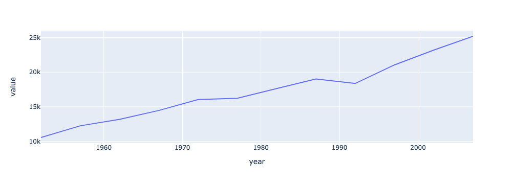
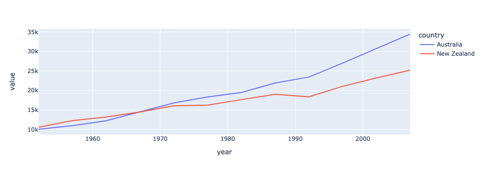
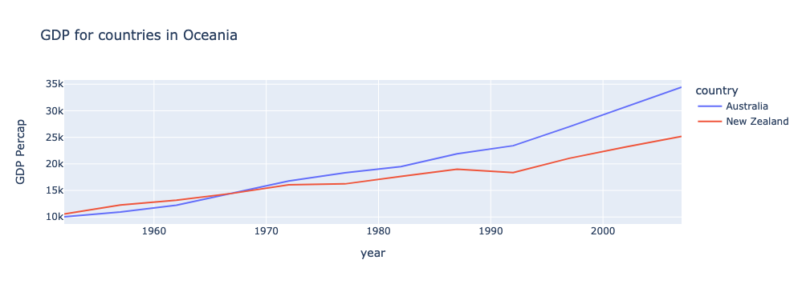

::::::::::::::::::::::::::::::::::::::: objectives

- Learn how to create and modify an interactive line plot using the px.line() function

::::::::::::::::::::::::::::::::::::::::::::::::::

:::::::::::::::::::::::::::::::::::::::: questions

- How can I create an interactive visualization using Plotly Express?

::::::::::::::::::::::::::::::::::::::::::::::::::

Now that our data is in a tidy format, we can start creating some visualizations. Let's start by creating a new notebook (make sure to select the `dataviz` kernel in the Launcher) and renaming it `data_visualizations.ipynb`.

Let's make our first cell into a markdown cell, and give this notebook a title:

```source
# Data Visualizations
```

Remember to also add some metadata and describe what this notebook does.

## Import our newly tidy data

First, we need to import pandas and Plotly Express, and then read in our dataframe.

```python
import pandas as pd
import plotly.express as px

df = pd.read_csv("Data/gapminder_tidy.csv")
df
```

## Creating our first plot

Our first plot is going to be relatively simple. Let's plot the GDP of New Zealand over time. First, let's figure out what our X and Y axis will need to be.

The X axis is typically used for time, so that will be our `year` column.
The Y axis will be the GDP amount, which is kept in the `value` column.

However, this dataframe has a lot of extra information in it. We want to create a new dataframe with only the rows we need for the visualization.
That means we need to filter for rows where the `country` is "New Zealand" and the `metric` is "gdpPercap".
We can do this with the `query()` function.

```python
df.query("country=='New Zealand'")
```

This will select all of the rows where `country` is "New Zealand". We can add our second condition by either chaining another `query()` function or specifying the additional condition in the same `query()` function.

```python
df.query("country=='New Zealand'").query("metric=='gdpPercap'")
df.query("country=='New Zealand' & metric=='gdpPercap'")
```

Let's make sure to save that filtered dataframe to a new variable.

```python
df_gdp_nz = df.query("country=='New Zealand' & metric=='gdpPercap'")
```

Now we can pass this dataframe to the `px.line()` function. At a minimum, we need to tell the function what dataframe to use, what column should be the X axis, and what column should be the Y axis.

```python
fig = px.line(df_gdp_nz, x = "year", y = "value")
fig.show()
```

{alt="Plot of New Zealand's GDP over time"}

There it is! Our first line plot.

## When you want to compare - adding more lines and labels

By itself, this plot of New Zealand's GDP isn't especially interesting. Let's add another line, to compare it to Australia.

First, we need to define a new dataframe to select the rows we need. This time, we will specify the `continent` as "Oceania".

```python
df_gdp_o = df.query("continent=='Oceania' & metric=='gdpPercap'")
df_gdp_o
```

Now, we will create another figure, but this time we need to pass an additional parameter: `color`.

```python
fig = px.line(df_gdp_o, x = "year", y = "value", color = "country")
fig.show()
```

{alt="Plot of Oceania's GDP over time"}

Great! This already looking better. But we should fix that y-axis label and add a title.

```python
title = "GDP for countries in Oceania"
fig = px.line(df_gdp_o, x = "year", y = "value", color = "country", title = title, labels={"value": "GDP Percap"})
fig.show()
```

{alt="Plot of Oceania's GDP over time with correct labels"}

:::::::::::::::::::::::::::::::::::::::::  callout

## Interactivity is baked in to Plotly charts

When you have many more lines, the interactive features of Plotly become very useful.
Notice how hovering over a line will tell you more information about that point.
You will also see several options in the upper right corner to further interact with the plot - including saving it as a PNG file!


::::::::::::::::::::::::::::::::::::::::::::::::::

## Exercises

:::::::::::::::::::::::::::::::::::::::  challenge

## Visualize Population in Europe

Create a plot that visualizes the population of countries in Europe over time.

:::::::::::::::  solution

## Solution

```python
df_pop_eu = df.query("continent=='Europe' & metric=='pop'")
fig = px.line(df_pop_eu, x = "year", y = "value", color = "country", title = "Population in Europe", labels={"value": "Population"})
fig.show()
```

:::::::::::::::::::::::::

::::::::::::::::::::::::::::::::::::::::::::::::::

:::::::::::::::::::::::::::::::::::::::  challenge

## Visualize Average Life Expectancy in Asia

Create a plot that visualizes the average life expectancy of countries in Asia over time.

:::::::::::::::  solution

## Solution

```python
df_le_as = df.query("continent=='Asia' & metric=='lifeExp'")
fig = px.line(df_le_as, x = "year", y = "value", color = "country", title = "Life Expectancy in Asia", labels={"value": "Average Life Expectancy"})
fig.show()
```

:::::::::::::::::::::::::

::::::::::::::::::::::::::::::::::::::::::::::::::


:::::::::::::::::::::::::::::::::::::::: keypoints

- Before visualizing your dataframe, make sure it only includes the rows you want to visualize. You can use pandas' `query()` function to easily accomplish this
- To make a line plot with `px.line`, you need to specify the dataframe, X axis, and Y axis
- If you want to have multiple lines, you also need to specify what column determines the line color
- In a Jupyter Notebook, you need to call `fig.show()` to display the chart

::::::::::::::::::::::::::::::::::::::::::::::::::


