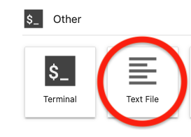

::::::::::::::::::::::::::::::::::::::: objectives

- Learn how to create a streamlit app
- Learn how to add text to the app
- Learn how to add plots to the app

::::::::::::::::::::::::::::::::::::::::::::::::::

:::::::::::::::::::::::::::::::::::::::: questions

- How do I create a Streamlit app?
- How can I see a live preview of my app?

::::::::::::::::::::::::::::::::::::::::::::::::::

Now that our data and visualizations are prepped, it's finally time to create our Streamlit app.

## Creating and starting the app

While you usually want to create Jupyter Notebooks in Jupyter Lab, you can also create other file types and have a terminal. We are going to use both of these capabilities.

From the Launcher, click on "Text File" under "Other" (make sure you are currently in your project root directory, and not the `data` folder). This will open a new file.

{alt='Open a Text File'}

By default, this will be a text file, but you can change this. Go ahead and save this empty file as `app.py` ("File" > "Save Text As..." > "app.py"). Then we can add some import statements, and save the file again.

```python
import streamlit as st
import pandas as pd
import plotly.express as px
```

Next, go back to the Launcher and click on "Terminal" under "Other". This will launch a terminal window within Jupyter Lab.

{alt='Open a Terminal'}

If you type `pwd` and enter, you will see that you are currently in your project root.

```bash
pwd
```

```output
/Users/<you>/Desktop/data_viz_workshop
```

If you type `ls` and enter, you will see all of your files and directories.

```bash
ls
```

```output
Data                      app.py                    data_visualizations.ipynb data_wrangling.ipynb      environment.yml
```

Make sure that you see `app.py`. We can also see what environment we are currently in with `conda env list`. There should be a \* next to `dataviz`.

```bash
conda env list
```

```output
# conda environments:
#
base                     /opt/anaconda3
dataviz               *  /opt/anaconda3/envs/dataviz
```

If not, go ahead and type `conda activate dataviz`.

```bash
conda activate dataviz
```

Now that we know we are in the right place and have the right environment (the one with streamlit installed), we are going to start the Streamlit app.

```bash
streamlit run app.py
```

This will launch our app in a new tab. Right now, the app is empty. So let's add some content!

## Add a title to the app

Go back to the tab in Jupyter Lab for our `app.py` file. We have some import statements, but no content. Let's start with a title:

```python
st.title("Interact with Gapminder Data")
```

You can make this title whatever you want. Save the file, and go back to the brower tab with our Streamlit app. Notice the prompt in the upper right corner? Go ahead and click on "Rerun". Now we can see our title!

We can add other text to our app with `st.write()` and other functions.

:::::::::::::::::::::::::::::::::::::::::  callout

## Check out the documentation

Whenever you are working with a new library - or even one that you are familiar with! - it's a good idea to look through the documentation.
You can find Streamlit's documentation [here](https://docs.streamlit.io/library/api-reference)


::::::::::::::::::::::::::::::::::::::::::::::::::

## Add a plot to the app

Now, let's go ahead and add the visualization of GDP in Oceania that we created in the previous lesson. We can copy and paste the code over from our Jupyter Notebook - but leave out the `fig.show()`. We're going to use a different function to display the plot in the Streamlit app: `st.plotly_chart()`

```python
df = pd.read_csv("Data/gapminder_tidy.csv")
df_gdp_o = df.query("continent=='Oceania' & metric=='gdpPercap'")

title = "GDP for countries in Oceania"
fig = px.line(df_gdp_o, x = "year", y = "value", color = "country", title = title, labels={"value": "GDP Percap"})
st.plotly_chart(fig)
```

Save `app.py`, switch over to the Streamlit app, and click "Rerun". Now we can see our Oceania GDP line chart!

Right now, this line chart is a bit squashed and small, so we're going to change some settings so the plot will take up more space.
First, at the beginning of the app we'll add the line: `st.set_page_config(layout="wide")`.
Next, we'll add an argument to our display function: `st.plotly_chart(fig, use_container_width=True)`

Our whole app script now looks like:

```python
import streamlit as st
import pandas as pd
import plotly.express as px

st.set_page_config(layout="wide")
st.title("Interact with Gapminder Data")

df = pd.read_csv("Data/gapminder_tidy.csv")
df_gdp_o = df.query("continent=='Oceania' & metric=='gdpPercap'")

title = "GDP for countries in Oceania"
fig = px.line(df_gdp_o, x = "year", y = "value", color = "country", title = title, labels={"value": "GDP Percap"})
st.plotly_chart(fig, use_container_width=True)
```

You know the drill! Save, switch over to the Streamlit app, and click "Rerun".

We now have a web application that can allow you to share your interactive visualizations.

{alt='Streamlit app after this lesson'}

## Exercises

:::::::::::::::::::::::::::::::::::::::  challenge

## Add a description

After the plot is displayed, add some text describing the plot.  Hint you may want look at the [Streamlit Reference Docs](https://docs.streamlit.io/library/api-reference)
to find an appropriate function.

:::::::::::::::  solution

## Solution

```python
st.plotly_chart(fig, use_container_width=True) # this line is already in the app
st.markdown("This plot shows the GDP Per Capita for countries in Oceania.")
```

:::::::::::::::::::::::::

::::::::::::::::::::::::::::::::::::::::::::::::::

:::::::::::::::::::::::::::::::::::::::  challenge

## Show me the data!

After the plot is displayed, also display the dataframe used to generate the plot.

:::::::::::::::  solution

## Solution

```python
st.dataframe(df_gdp_o) # df_gdp_o is defined in the code created in this lesson
```

:::::::::::::::::::::::::

::::::::::::::::::::::::::::::::::::::::::::::::::


:::::::::::::::::::::::::::::::::::::::: keypoints

- The entire streamlit app must be saved in a single python file, typically `app.py`
- To run the app locally, enter the bash command `streamlit run app.py`
- Add a title with `st.title('Title')`, and other text with `st.write('## Markdown can go here')`
- Make sure your dataframes and figures are stored in variables, typically `df` for a dataframe and `fig` for a figure
- To display a plotly figure, use `st.plotly_chart(fig)`

::::::::::::::::::::::::::::::::::::::::::::::::::


