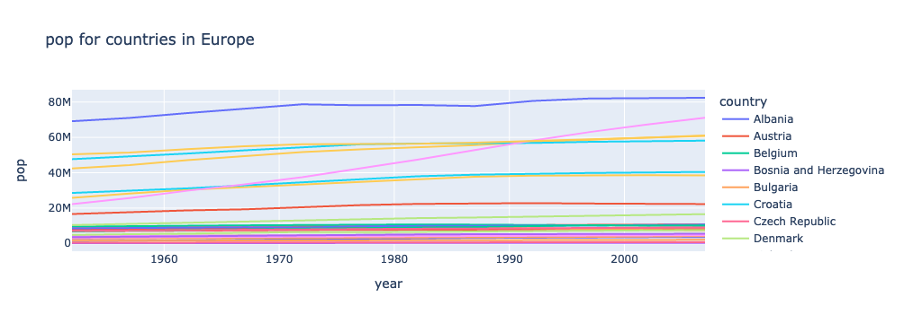
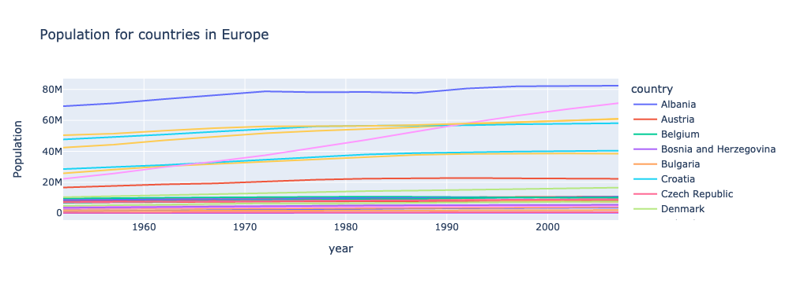
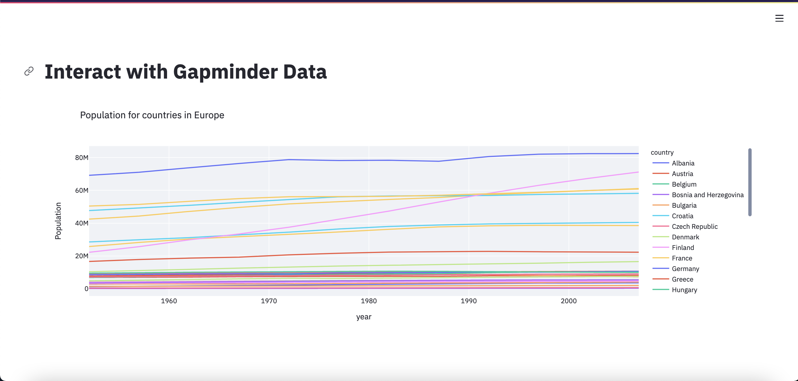

::::::::::::::::::::::::::::::::::::::: objectives

- Learn about f-Strings
- Learn how to adjust hard-coded values to be variable

::::::::::::::::::::::::::::::::::::::::::::::::::

:::::::::::::::::::::::::::::::::::::::: questions

- How does the current code need to change in order to incorporate widgets?
- What aspects of the code need to change?
- What does it mean to 'refactor' code?

::::::::::::::::::::::::::::::::::::::::::::::::::

We now have a working Streamlit app. However, it is only displaying one plot, and we can't currently change what that plot is showing.
And we know that there is a lot more information to visualize in our dataset!
So we are going to add in even more interactivity with some widgets.
Widgets are an interface for users to set a variable to some value.
For example, we we may want users to choose from a drop down menu widget to control which continent is displayed.
However, before we can add in widgets, we need to refactor our code to allow for more user flexiblity in what is displayed. Our code needs to be refactored to use variables instead of "hard-coded" values.

For now, we will set these variables (`continent` and `metric` in the code below) to be strings. That means that after refactoring, the app will not actually look any different. However, it will make adding the widgets in much easier - because we will assign those `continent` and `metric` variables to the widget output.

The `app.py` file is not a great place to experiment and iterate with our code. For that, let's go back to our `data_visualizations. ipynb` Jupyter notebook.

We can add a markdown cell at the bottom of the notebook, and give this section a subtitle:

```source
## Prep for widgets
```

## f-Strings for variables within strings

First, let's decide what attributes we want to be able to change in the plot. Right now, the plot is showing the GDP for countries in Oceania - that right there is two different attributes: the metric (GDP) and the continent (Oceania).

These are also the two attributes that we are filtering for using `df.query()`:

```python
df_gdp_o = df.query("continent=='Oceania' & metric=='gdpPercap'")
```

Notice that what is passed to `df.query()` is simply a string. Right now, the specific values of "Oceania" and "gdpPercap" are specified in the string. However, we can easily make these values variable using f-Strings.

:::::::::::::::::::::::::::::::::::::::::  callout

## learn more about f-Strings

f-Strings are the modern way of formatting strings in Python.
You may have used the "old-school" methods of %-formatting or `str.format()` to accomplish the same goal, but the syntax for f-Strings is much nicer.
You can learn more about f-Strings [here](https://realpython.com/python-f-strings/).


::::::::::::::::::::::::::::::::::::::::::::::::::

To incorporate f-Strings into our query, let's tweak a few things. Try out this code in a cell in your Jupyter Notebook.

```python
continent = "Oceania"
metric = "gdpPercap"

old_query = "continent=='Oceania' & metric=='gdpPercap'"
new_query = f"continent=='{continent}' & metric=='{metric}'"

print(old_query)
print(new_query)
```

```output
continent=='Oceania' & metric=='gdpPercap'
continent=='Oceania' & metric=='gdpPercap'
```

Notice how the two strings are identical?

The `new_query` variable is more flexible, because we can redefine the `continent` and `metric` variables. Go ahead and try it!

```python
continent = "Europe"
metric = "pop"

query = f"continent=='{continent}' & metric=='{metric}'"

print(query)
```

```output
continent=='Europe' & metric=='pop'
```

It's important to isolate these `continent` and `metric` values because we can adjust them with our widgets.

Let's go ahead and try incorporating this into our plot (still in the Jupyter Notebook)

```python
continent = "Europe"
metric = "pop"

query = f"continent=='{continent}' & metric=='{metric}'"
df_filtered = df.query(query)

title = "GDP for countries in Oceania"
fig = px.line(df_filtered, x = "year", y = "value", color = "country", title = title, labels={"value": "GDP Percap"})
fig.show()
```

{alt="Plot of Europe's population over time with wrong labels"}

Something about this plot is funky... do you notice any other places where we need to incorporate f-Strings?

The title and axis lables!

```python
continent = "Europe"
metric = "pop"

title = f"{metric} for countries in {continent}"
labels = {"value": f"{metric}"}

print(title)
print(labels["value"])
```

```output
pop for countries in Europe
pop
```

Let's show that plot again, with our updated code:

```python
continent = "Europe"
metric = "pop"

query = f"continent=='{continent}' & metric=='{metric}'"
df_filtered = df.query(query)

title = f"{metric} for countries in {continent}"
fig = px.line(df_filtered, x = "year", y = "value", color = "country", title = title, labels={"value": f"{metric}"})
fig.show()
```

{alt="Plot of Europe's population over time with correct labels"}

There's just one more thing to tweak. "gdpPercap", "lifeExp", and "pop" aren't the prettiest labels. Let's map them to more display-friendly labels with a dictionary. Then we can call on this dictionary within our f-strings:

```python
metric_labels = {"gdpPercap": "GDP Per Capita", "lifeExp": "Average Life Expectancy", "pop": "Population"}
```

Now, here's our final code:

```python
continent = "Europe"
metric = "pop"

query = f"continent=='{continent}' & metric=='{metric}'"
df_filtered = df.query(query)

metric_labels = {"gdpPercap": "GDP Per Capita", "lifeExp": "Average Life Expectancy", "pop": "Population"}

title = f"{metric_labels[metric]} for countries in {continent}"
fig = px.line(df_filtered, x = "year", y = "value", color = "country", title = title, labels={"value": f"{metric_labels[metric]}"})
fig.show()
```

{alt="Plot of Europe's population over time with better labels"}

## Getting lists of possible values

There is one last step before we can be ready to create our widgets. We need a list of all continents and all metrics, so that users can select from valid options. To do this, we will use pandas' `unique()` function.

```python
df['continent'].unique()
```

```output
array(['Africa', 'Americas', 'Asia', 'Europe', 'Oceania'], dtype=object)
```

See how we get every possible value in the `continents` column exactly once? Let's define this as a list, assign it to a variable, and do the same thing for `metric`.

```python
continent_list = list(df['continent'].unique())
metric_list = list(df['metric'].unique())

print(continent_list)
print(metric_list)
```

```output
['Africa', 'Americas', 'Asia', 'Europe', 'Oceania']
['gdpPercap', 'lifeExp', 'pop']
```

These lists will be used when defining our widgets.

## Update app.py with our refactored code

Now, we are ready to define our widgets. Let's copy this final code over to our `app.py` file, so that it is like this:

```python
import streamlit as st
import pandas as pd
import plotly.express as px

st.set_page_config(layout="wide")
st.title("Interact with Gapminder Data")

df = pd.read_csv("Data/gapminder_tidy.csv")

continent_list = list(df['continent'].unique())
metric_list = list(df['metric'].unique())

continent = "Europe"
metric = "pop"

query = f"continent=='{continent}' & metric=='{metric}'"
df_filtered = df.query(query)

metric_labels = {"gdpPercap": "GDP Per Capita", "lifeExp": "Average Life Expectancy", "pop": "Population"}

title = f"{metric_labels[metric]} for countries in {continent}"
fig = px.line(df_filtered, x = "year", y = "value", color = "country", title = title, labels={"value": f"{metric_labels[metric]}"})
st.plotly_chart(fig, use_container_width=True)
```

{alt="Streamlit app after this lesson"}

## Exercises

:::::::::::::::::::::::::::::::::::::::  challenge

## Add a (flexible) description

After the plot is displayed, add some text describing the plot.

This time, use F-strings so the description can change with the plot

:::::::::::::::  solution

## Solution

```python
st.markdown(f"This plot shows the {metric_labels[metric]} for countries in {continent}.")
```

:::::::::::::::::::::::::

::::::::::::::::::::::::::::::::::::::::::::::::::

:::::::::::::::::::::::::::::::::::::::  challenge

## Show me the data! (Maybe)

After the plot is displayed, also display the dataframe used to generate the plot.

This time, make it optional - only display the dataframe if a variable is set to True.

:::::::::::::::  solution

## Solution

```python
show_data = True
if show_data:
    st.dataframe(df_filtered)
```

:::::::::::::::::::::::::

::::::::::::::::::::::::::::::::::::::::::::::::::


:::::::::::::::::::::::::::::::::::::::: keypoints

- In order to add widgets, we need to refactor our code to make it more flexible.
- f-Strings allow you to easily insert variables into a string

::::::::::::::::::::::::::::::::::::::::::::::::::


